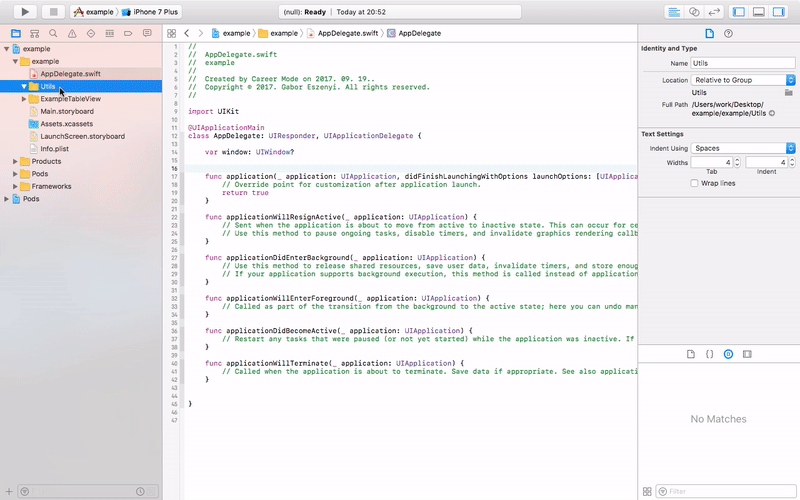

# iOS Swift File Templates for Xcode using  RxSwift, RxCocoa and RxDataSources

## About this project

These templates are designed to speed up and make the iOS development so much easier by eliminating the repeating processes and making your code better organized.

## Dependencies

The templates are using some reactive libraries such as [RxSwift](https://github.com/ReactiveX/RxSwift), [RxCocoa](https://github.com/ReactiveX/RxSwift/tree/master/RxCocoa) and [RxDataSources](https://github.com/RxSwiftCommunity/RxDataSources).

## Usage

#### Installing

To install the templates run the `install-templates.sh` script in the terminal.
```shell
./install-templates.sh
```

#### Uninstalling

If you'd like to remove the previously installed templates run the `uninstall-templates.sh` script.
```shell
./uninstall-templates.sh
```
#### Updating

For updating the templates you must remove them first, then run the install script.
```shell
./uninstall-templates.sh
./install-templates.sh
```
### Preparing your project

Add these pods to your Xcode project:
```ruby
pod 'RxSwift',    '~> 4.1.1'
pod 'RxCocoa',    '~> 4.1.1'
pod 'RxDataSources', '~> 3.0.2'
```
You also have to add the files from **TableView Requirements** template.

Just press <kbd>CMD</kbd> + <kbd>N</kbd> or right click on your source files in Xcode and select **New file...**. 

Scoll down to **MV[C]VM - Utilities** section and select **TableView Requirements**. Then click on **Next** and **Create**.

Now you're done and you can use all the templates.



### With these easy steps you can make a list presenting some data:

##### STEP 1

* Add a `Cell with Model` from the previously installed templates. 

* Add the necessary properties to your **model**.
* Add an `init()` method to the **model** and pass these properties as parameters.

##### STEP 2

* Add properties (`Variable` types) to the **viewmodel** which going to be connected with the **cell's** outlets.
* In the **viewmodel** there'll be a variable `var model` with the same type of the **model**. This variable will have a `didSet` method. Update the **viewmodel** properties here.

##### STEP 3

* Create the outlets in the **cell**. (Not required in this example.)
* Bind the **cell's** outlets with the **viewmodel's** properties in the `setUpBindings()` method.

##### STEP 4

* Add a `TableView-IH with [multi sections]` from the previously installed templates. 
* Fill the ViewController's **viewmodel** with some data (sections property).

##### STEP 5

* Add a UITableViewController to the storyboard and set its *class*.
* Set the entry point.
* Add a prototype cell to the tableview and set its *class* and the *reuseidentifier*.
* Also add the necassary outlets and constraints to the **cell**. (Not required in this example.)
* Connect these outlets with the code. (Not required in this example.)

##### FINAL STEP

* Build and run. 🎉

##### [Video tutorial](https://youtu.be/LrHBwWcUx3Y)

## Examples

* [Simple example](https://github.com/egabor/swift-mvcvm-tableview-example-2)

* Detailed example (Coming soon.)

## Donations

All donations are appreciated. ❤️

* BTC address: **127tUY5nWP3ucv6uweion1cCGeraEXsfzV**

* ETH address: **0x53510eB7E2C683E28ecefEfc0B0a887227ed3da6**

Don't forget to leave a star here. 😀👍

## Meaning of emojis used in commit messages
Commit Type | Emoji
----------  | -----
Initial Commit | 🎉 Party Popper
Metadata | 🔖 Bookmark
New Feature | ✨ Sparkles
Bugfix | 🐛 Bug
Version tag | 🎟️ Admission Tickets
Refactoring | ♻️ Black Universal Recycling Symbol
Documentation | 📚 Books
Internationalization | 🌐 Globe With Meridians
Performance | 🐎 Horse
Cosmetic | 🎨 Artist Palette
Tooling | 🔧 Wrench
Tests | 🚨 Police Cars Revolving Light
Deprecation | 💩 Pile of Poo
Removal | 🗑️ Wastebasket
Work In Progress (WIP) | 🚧 Construction Sign
| Lint                       | :shirt: `:shirt:`                             |
| Translation                | :alien: `:alien:`                             |
| Critical hotfix            | :ambulance: `:ambulance:`                     |
| Accessibility              | :wheelchair: `:wheelchair:`                   |
| Code review changes        | :ok_hand: `:ok_hand:`                         |
| Analytics or tracking code | :chart_with_upwards_trend: `:chart_with_upwards_trend:` |
| Removing a dependency      | :heavy_minus_sign: `:heavy_minus_sign:`       |
| Adding a dependency        | :heavy_plus_sign: `:heavy_plus_sign:`         |
| Security                   | :lock: `:lock:`                               |
| General update             | :zap: `:zap:`                                 |
| Text                       | :pencil: `:pencil:`                           |
